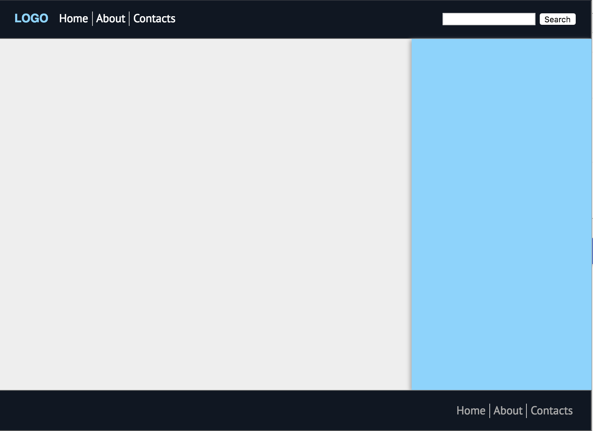
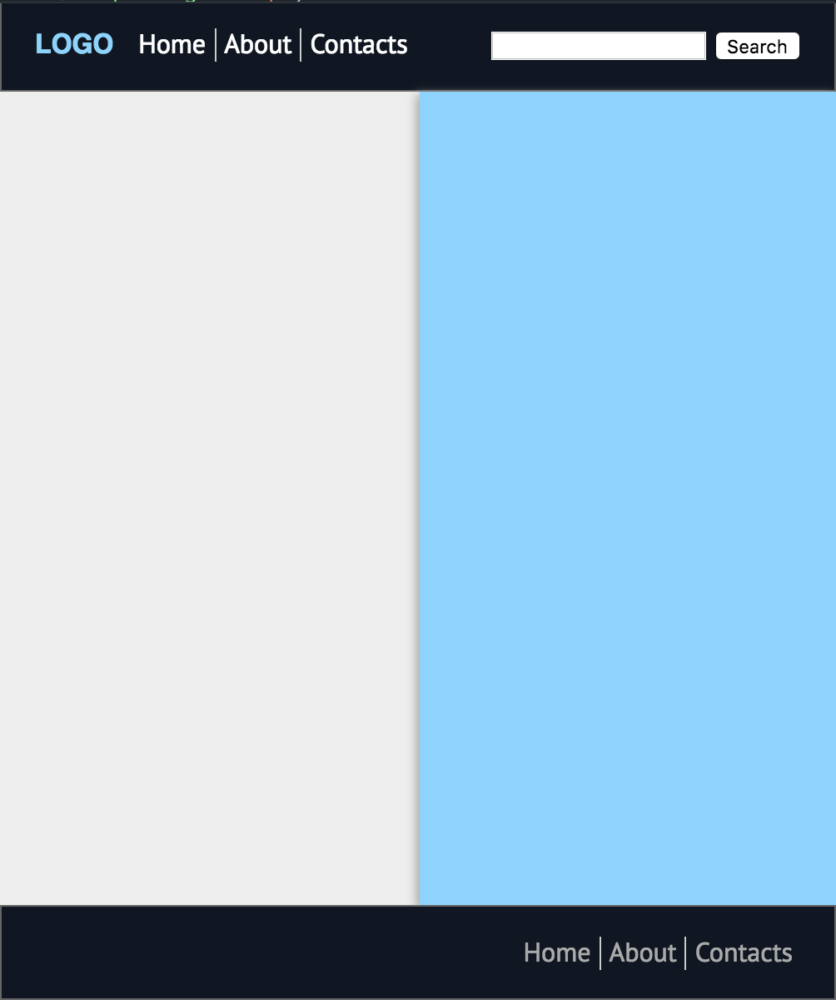

## DESCRIPTION:

This task should be solved using Grid and Flexbox layout models.

You should edit only `task.css` to sattisfy requirements and achieve look provided in `examples` folder.

> **NOTE:** You should not edit `index.html` and `default.css` files, and override only necessary styles in `task.css`.

## REQUIREMENTS:

Block .page-layout should set-up basic grid using CSS Grid's properties;
General blocks header, footer, main, aside should be positioned with CSS Grid's features;

Elements inside general blocks should be positioned using Flexbox; Header navigation with Logo should be aligned to the left, Search form should be aligned to the right; Footer navigation should be aligned to the right; Both navigations should not wrap when resize.

"Aside"(blue) block should take no more than 25% of width and be not less 250px of width when resize; "Main"(lightgrey) block should be in raw with "Aside" and take all available space, it also should be not less than 250px of width when reisize;

Support all major browsers:
 * Chrome
 * Firefox
 * Edge
 * IE 11 (pay attention)
 * Safari

 ## WORKFLOW:
Add necessary styles to `task.css`.

Commit all files to git into

branch `04-markup-advanced`

folder `04-markup-advanced/03-flexbox-and-grid/task-06`

Result structure should be the same as provided with task.

## SOURCES:

`index.html` and `default.css` - contain all necessary markup and page styles. Students shouldn't edit this files.
`task.css` - file where all styles should be applied.
`examples` - foolder that contains examples of expected layout for each task part.

## DEADLINE:

Due Date - 01-10-2019 23:59.

Penalty will be applied for each overdue day.
